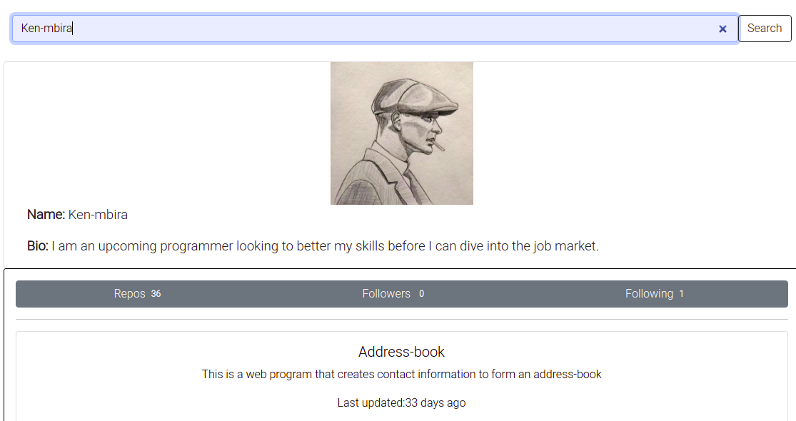

# GitFinder

This web application offers a simple way to access the users on github and see a summary of thier details. The user only has to enter the git-hub username of the person they wish to search for and the results will be shown to them, if the search is inconclusive the page will respond with a not-found page.

## Contributors
1. Ken Mbira

## Technologies Used
1. Angular
2. TypeScript
3. HTML
4. CSS
5. Bootstrap
6. JavaScript

## Live link
If you wish to see the following application in action click here

## Known Bugs
This application joins the following and followers dection when you search for a new user and so gives inconclusive data. If you feel that you can find a way around this, feel free to clone the repo and make any necessary changes

## Contact Information
1. Phone: 0758926990
2. email: mbiraken17@gmail.com
3. Git-hub: Ken-mbira
4. LinkedIn: Ken Mbira
5. Slack: Ken Mbira

## Setting-up information
If you wish to have the following application in your local device, follow the following steps:
1. Clone this repository using the command "https://github.com/Ken-mbira/Git-finder.git" in your commandline 
2. Open the directory containing the application on your preffered code editor and in the directory src create the folder environments and in it the file environment. In this file add a variable 'apiKey' and copy into it your Api Key provided by Git-hub. If you do not know how to get one, click [here](https://docs.github.com/en/github/authenticating-to-github/keeping-your-account-and-data-secure/creating-a-personal-access-token)
3. Save and run ng serve -o on your terminal

## Requirements
To run the following app on your code editor make sure you have the following: 
1. Node version 14 or higher
2. Angular CLI version 12.2.0 or higher

## Licence Information
MIT License

Copyright (c) [2021] [Ken-Mbira]

Permission is hereby granted, free of charge, to any person obtaining a copy
of this software and associated documentation files (the "Software"), to deal
in the Software without restriction, including without limitation the rights
to use, copy, modify, merge, publish, distribute, sublicense, and/or sell
copies of the Software, and to permit persons to whom the Software is
furnished to do so, subject to the following conditions:

The above copyright notice and this permission notice shall be included in all
copies or substantial portions of the Software.

THE SOFTWARE IS PROVIDED "AS IS", WITHOUT WARRANTY OF ANY KIND, EXPRESS OR
IMPLIED, INCLUDING BUT NOT LIMITED TO THE WARRANTIES OF MERCHANTABILITY,
FITNESS FOR A PARTICULAR PURPOSE AND NONINFRINGEMENT. IN NO EVENT SHALL THE
AUTHORS OR COPYRIGHT HOLDERS BE LIABLE FOR ANY CLAIM, DAMAGES OR OTHER
LIABILITY, WHETHER IN AN ACTION OF CONTRACT, TORT OR OTHERWISE, ARISING FROM,
OUT OF OR IN CONNECTION WITH THE SOFTWARE OR THE USE OR OTHER DEALINGS IN THE
SOFTWARE.